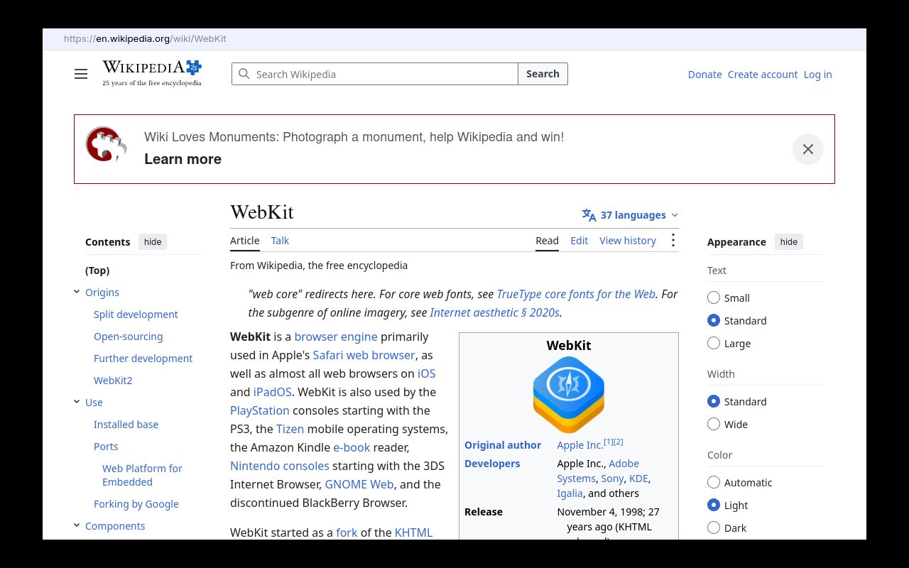
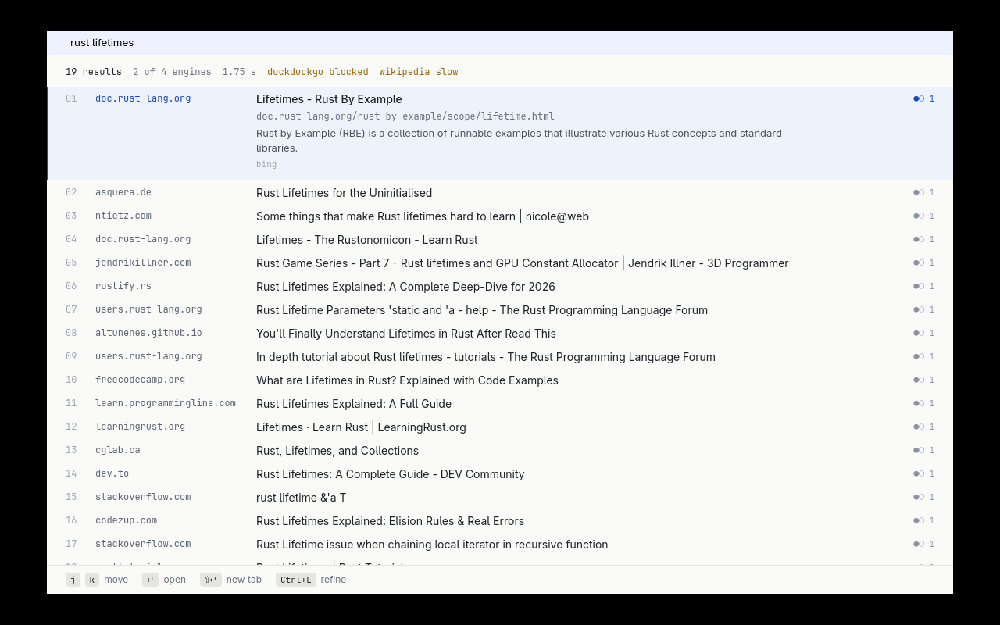
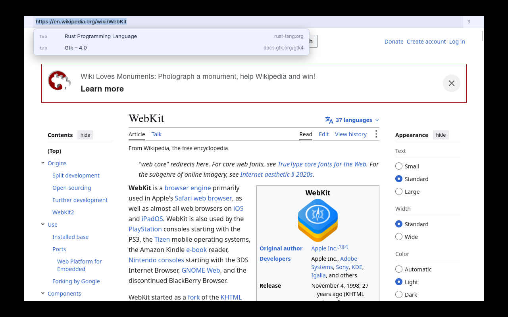

# Bare

**A web browser with no title bar. Just the page.**



Bare is a small Linux web browser: a Rust + GTK 4 shell around **WebKitGTK 6.0**, the engine GNOME Web
uses. The window has one thin URL bar above the page and nothing else: no title bar, no tab strip, no
toolbar buttons.

Bare does not render anything itself. HTML, CSS, JavaScript, networking, process isolation and the
sandbox all come from WebKitGTK. What Bare adds:

- **The frameless window.** No title bar, so the URL bar, the empty new-tab page and the window edges
  stand in for one (drag to move, edges to resize, Alt+drag anywhere).
- **A keyboard-first URL bar** that is also the tab switcher, with history, bookmarks and open tabs
  as suggestions.
- **Bare Search,** a Rust port of the [SearXNG](https://github.com/searxng/searxng) metasearch
  pipeline that runs inside the browser process. It needs no server, no port and no Python. It queries
  several engines at once, merges and ranks the results, and backs off from engines that block it.
- **Content blocking inside WebKit.** It converts EasyList and EasyPrivacy to WebKit's content-blocker
  format. WebKit compiles that once and applies it in the engine, so no extension or injected script
  is involved.
- **Idle-tab discarding.** Background tabs are unloaded after 10 minutes (their web process ends) and
  come back with their history and scroll position.

> **Status: v0.1.0, early.** Linux only. Built and tested on Arch-based CachyOS under **X11**;
> **Wayland is untested.** No distribution packages it; this repository has a PKGBUILD. Expect rough
> edges.

## Numbers

Measured on one machine (i3-12100, 16 GB, software rendering in a headless X server), with details,
caveats and raw output in **[BENCHMARKS.md](BENCHMARKS.md)**:

| | Bare | Firefox 156 |
|---|---|---|
| window on the home page | 109 MB, 1 process | |
| 5 tabs, all loaded (same 5 static local pages) | 541 MB, 26 processes | 671 MB, 13 processes |
| the same 5 tabs after the 4 background tabs were discarded | 297 MB, 8 processes | (no equivalent) |
| idle CPU with the 5 pages loaded, one core = 100 % | 0.0 % | 0.4 % |
| start-up, `main()` to first frame | 249 ms | (not comparable) |

Memory is PSS summed over each browser's process tree, as the median of 3 runs. Most of Bare's saving
comes from discarding idle tabs; with every tab live it used about 20 % less than Firefox on this one
static-page workload. Idle CPU is a tie. Bare's own work on a search (parse, merge, render) takes under
1 ms; the engines' response time decides how fast a search is.

## What it is not

Read this before you try it:

- **Not a new browser engine.** Page compatibility and security are WebKitGTK's. Bare cannot fix
  engine bugs, so keep your distribution's `webkitgtk-6.0` up to date. Sites built and tested only
  for Chrome sometimes break in WebKitGTK browsers, Bare included.
- **Not full-featured.** There are no extensions, sync, password manager, private windows, settings
  UI (configuration is one TOML file) or download manager. Notifications, camera and microphone
  requests are refused, so video calls do not work. Of the permission requests, only location is
  asked about.
- **Not portable yet.** It needs **WebKitGTK ≥ 2.52, GTK ≥ 4.12 and Rust ≥ 1.98** (edition 2024;
  use rustup if your distribution's Rust is older). It has only been built on Arch, and nothing in it
  targets macOS or Windows.
- **Bare Search scrapes two of its engines.** Bing and DuckDuckGo offer no free search API, so, like
  SearXNG, Bare fetches their HTML results pages with a Firefox User-Agent
  ([`fetch.rs`](crates/bare-search/src/fetch.rs)) and parses them with CSS selectors. That breaks when
  their markup changes. They also block automated traffic: DuckDuckGo answered with a captcha in the
  measurements below. Scraping may also be against their terms of service. Wikipedia, Marginalia,
  GitHub, Stack Exchange and the Arch Wiki are queried through their public APIs, identified as
  `Bare/0.1.0`.
- **Not uBlock Origin.** The converter handles a conservative subset of the Adblock Plus syntax.
  Regex filters, scriptlets and procedural cosmetic filters are skipped and counted, never guessed at.
  Ads that need those rules to block (mostly on video sites) still show.
- **Uneven test coverage.** The two logic crates have 138 unit and integration tests. The GUI crate
  has none; a 135-check headless script covers it (see [Tests](#tests)).

## Screenshots

| Bare Search results (live engines) | URL bar as tab switcher |
|---|---|
|  |  |

Screenshots were taken in a headless X server with software rendering and the Openbox window manager.
The black around the window is the bare X root window; Bare draws no frame of its own.

## How it works

```
bare                               Rust + GTK 4: window, URL bar, tabs, history (SQLite), bookmarks,
│                                  Bare Search, bare:// pages, filter-list loading
├── WebKitNetworkProcess           WebKitGTK: HTTP, cookies, cache; one, shared by every tab
├── bwrap ─ bwrap ─ xdg-dbus-proxy WebKitGTK's sandbox: filtered D-Bus access for web processes
└── bwrap ─ bwrap ─ WebKitWebProcess   (× n) WebKitGTK: a tab's page, in a bubblewrap sandbox;
                                   a discarded tab has none, and an empty tab never starts one
```

That tree is from `ps --forest` with one tab open
([`docs/bench/process-tree.txt`](docs/bench/process-tree.txt)). Pages opened from another page
(`window.open`, `target=_blank`) share their opener's web process.

The repository is a Cargo workspace of three crates:

| Crate | Lines (code / tests) | What it owns |
|---|---|---|
| [`bare`](crates/bare) | 3,007 / 0 | The GTK application: the frameless window, URL bar and dropdown, tabs and discarding, find bar, permission bar, WebKit session and settings, `bare://` pages, filter-list loading, `--update-filters` |
| [`bare-core`](crates/bare-core) | 1,783 / 1,334 | GUI-free logic: what typed input means (address or search), suggestion ranking, history (SQLite, "frecency" ranking), bookmarks, config, paths, downloads naming, and the Adblock-Plus-to-WebKit filter converter |
| [`bare-search`](crates/bare-search) | 1,393 / 1,080 | The SearXNG port: query syntax (`!engine`, `:lang`), engine definitions in TOML, fetching, parsing, backoff, merging and scoring, and the results page |

Line counts come from `wc -l`; inline `#[cfg(test)]` modules count as tests.

**The frameless window.** A `gtk::Window` with `decorated(false)`. Dragging the bar calls GDK's
`Toplevel::begin_move`; invisible strips along the edges call `begin_resize`. Either way the window
manager does the move or resize, just as it would for a title bar
([`wm.rs`](crates/bare/src/wm.rs), [`window/frame.rs`](crates/bare/src/window/frame.rs)).

**Bare Search** ([`bare-search`](crates/bare-search)) follows SearXNG's pipeline:

1. Parse the query's `!engine`, `!category` and `:lang` prefixes.
2. Ask the chosen engines in parallel, one thread each, through
   [`ureq`](https://crates.io/crates/ureq). Once one engine has answered, the rest get a short grace
   period. Late answers are still recorded for engine health.
3. Parse each response with that engine's TOML definition
   ([`engines/`](crates/bare-search/engines)): CSS selectors for HTML, field paths for JSON.
4. Suspend engines that fail, as SearXNG does. A captcha or HTTP 429 backs off longer than a timeout.
5. Merge the lists, deduplicating by URL. Each result scores
   `(Π engine weights) × (number of engines) × Σ 1/position`, the formula from SearXNG's
   `results.py`.
6. Render `bare://search` as static HTML with a strict Content-Security-Policy. The only script is a
   few lines of j/k navigation.

Everything except the HTTP call is pure. Every engine is tested against a recorded real response,
including recorded captcha and rate-limit pages, in
[`tests/fixtures`](crates/bare-search/tests/fixtures). `cargo bs <query>` runs the pipeline from a
terminal.

**Content blocking** ([`bare-core/src/filters.rs`](crates/bare-core/src/filters.rs),
[`bare/src/filters.rs`](crates/bare/src/filters.rs)). WebKit rejects a whole rule list if any single
rule is invalid. So the converter only emits rules it can prove valid: network filters with
`||host^`, wildcards, resource types, `third-party`, `domain=`, exceptions, and simple element hiding.
WebKit compiles the result into a binary form and caches it under a hash of the list, so an unchanged
list is never compiled twice. Downloading and converting happen in a child process
(`bare --update-filters`), so the browser never holds that memory; the running browser swaps the new
list in without a restart.

**Tab discarding** ([`window/tabs.rs`](crates/bare/src/window/tabs.rs)). A tab left in the background
for `discard_minutes` has its WebKit `session_state()` saved and its web view dropped, which ends its
web process. Switching back creates a new view and restores that state.

## Build and run

You need WebKitGTK 6.0 (≥ 2.52), GTK 4 (≥ 4.12), SQLite, and Rust ≥ 1.98.

```sh
git clone https://github.com/don2e4/bare-browser
cd bare-browser
cargo run --release -- example.com         # the binary is target/release/bare
```

**Arch / CachyOS:** build and install the package from the working tree. It installs the `bare`
command, a desktop entry, an icon, a man page and the licenses:

```sh
cd packaging/arch && makepkg -si
```

Video and audio need GStreamer plugins: `gst-plugins-good`, plus `gst-plugins-bad` and `gst-libav`
for more formats. To make Bare your default browser, run
`xdg-settings set default-web-browser app.bare.Browser.desktop`.

Keys, URL bar syntax, search prefixes, the config file and troubleshooting are in
**[docs/usage.md](docs/usage.md)**. The short version: Ctrl+L for the URL bar, Ctrl+T and Ctrl+W
for tabs, F11 for fullscreen. Type an address to go there, or anything else to search.

## Tests

```sh
cargo test --workspace                          # 138 tests: input, suggestions, history, filters,
                                                # every engine parser, the search pipeline on a fake network
BARE_BIN=target/release/bare tools/shot.sh      # 135 checks against the real browser, headless
tools/measure.sh                                # memory, processes, idle CPU, start-up (FIREFOX=1 compares)
cargo bs probe                                  # live: ask every search engine, report which answer
```

`tools/shot.sh` runs the real browser under Openbox in Xvfb and drives it with `xdotool`. It checks
that the window has no title bar (`_MOTIF_WM_HINTS` and Openbox frame extents). A normal `st` window
serves as a control that must report a title bar, which proves the check can fail. It then covers
navigation, tabs, discard and restore, resize, drag-to-move, fullscreen, find, downloads, the
location prompt, content blocking (including WebKit compiling the full EasyList + EasyPrivacy) and
filter-list refresh. It needs Xvfb, Openbox, xdotool, xprop, ImageMagick and `st`.

## License

AGPL-3.0-or-later; see [LICENSE](LICENSE). Bare Search is a port of SearXNG (AGPL-3.0-or-later), and
its engine definitions are derived from SearXNG's. WebKitGTK is LGPL-2.1+. EasyList and EasyPrivacy
are downloaded from their publishers, not distributed here. [NOTICE](NOTICE) has the details.
